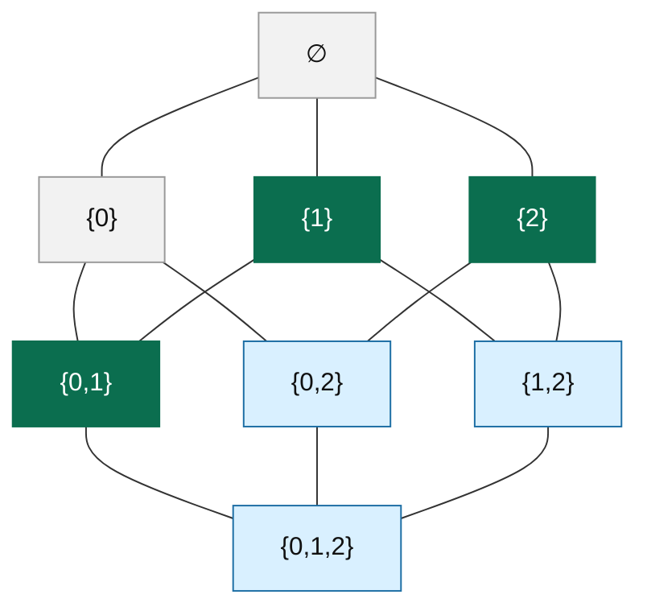

# Lean Experiments

[](https://github.com/kirill-kondrashov/lean-misc/actions/workflows/lean_action_ci.yml)

Lean formalization experiments and problem-focused developments, using a project structure modeled
after <https://github.com/kirill-kondrashov/yoccos-theorem>.

## At a glance

- Main active fronts:
  [Erdős #1](#erdős-1) and [Erdős #142](#erdős-142)
- Toolchain:
  Lean `v4.27.0`, mathlib `v4.27.0`
- Main entrypoint for the current Erdős #1 frontier:
  [ErdosProblems/Problem1CubeHalfBoundary.lean](./ErdosProblems/Problem1CubeHalfBoundary.lean)
- Main entrypoint for the current Erdős #142 frontier:
  [ErdosProblems/Problem142Gap.lean](./ErdosProblems/Problem142Gap.lean)

## Quick links

- [Repository map](#repository-map)
- [Toolchain](#toolchain-and-dependencies)
- [Common commands](#common-commands)
- [Verification policy](#verification-policy)
- [CI workflow](#ci-workflow-github-actions)
- [Erdős #1](#erdős-1)
- [Erdős #142](#erdős-142)

## Repository map

GitHub renders the old table too narrowly, so this section uses a list instead.

- `Erdos1.erdos_1`
  Statement layer for Erdős Problem #1, sum-distinct variants, and the imported/open literature endpoints.
  Main file: [ErdosProblems/Problem1.lean](./ErdosProblems/Problem1.lean)

- `TaoExercises.TaoBook.Chapter2.exercise_2_3`
  Exercise 2.3: `x^4 + 131 = 3y^4` has no integer solutions.
  Main file: [TaoExercises/TaoBook/Chapter2.lean](./TaoExercises/TaoBook/Chapter2.lean)

- `TaoExercises.TaoBook.Chapter2.exercise_2_6`
  If `k` is odd, then `1^k + 2^k + ··· + n^k` is divisible by `1 + 2 + ··· + n`.
  Main file: [TaoExercises/TaoBook/Chapter2.lean](./TaoExercises/TaoBook/Chapter2.lean)

- `ErdosProblems` (`Erdos142`)
  Erdős #142 statement, explicit-profile strengthening, gap decomposition, and the current frontier packages.
  Main file: [ErdosProblems/Problem142Gap.lean](./ErdosProblems/Problem142Gap.lean)

## Toolchain and dependencies

| Component | Version |
| --- | --- |
| Lean | `leanprover/lean4:v4.27.0` |
| mathlib | `v4.27.0` |
| doc-gen4 | `v4.27.0` |

## Common commands

| Task | Command |
| --- | --- |
| Build everything | `make build` |
| Check axioms | `make check` |
| Verify README checker output | `make verify` |
| Refresh cache + build + check | `make auto-build` |
| Build docs | `make docs` |
| Direct `lake` build | `lake build` |
| Direct checker run | `lake exe check_axioms` |

## Verification policy

All solved exercises are checked to ensure they:

- do not use `sorry`
- depend only on the base axioms `propext`, `Quot.sound`, and `Classical.choice`
- build the top-level `ErdosProblems` library, including the `Erdos1` modules
- include the checked `Erdos1` theorems
  (`Erdos1.erdos_1.variants.weaker`, `Erdos1.choose_middle_isEquivalent`,
  and the temporary-axiom wrapper `Erdos1.erdos_1_solution_axiom`)
- include the Problem #142 DeepMind-equivalence theorem
  (`Erdos142.erdos_problem_142_iff_deepmind`)
- include the strengthened explicit-profile DeepMind-equivalence theorem
  (`Erdos142.erdos_problem_142_explicit_iff_deepmind`)
- keep checker output explicit about temporary axiom frontier debt where present

The checker now imports the top-level `ErdosProblems` library, so `Erdos1` is built as part of
`make check`. It currently reports two `Erdos1` theorems that are fully local and base-axiom
clean: `Erdos1.erdos_1.variants.weaker` and `Erdos1.choose_middle_isEquivalent`.
It also reports the open-problem wrapper `Erdos1.erdos_1_solution_axiom`, with the placeholder
axiom `Erdos1.erdos_1` treated as temporary allowed axiom debt in the same style as the current
`Erdos142` frontier checks.
The exact-value theorems proved by `native_decide` are still excluded from this checker because the
current policy treats `Lean.ofReduceBool` / `Lean.trustCompiler` as non-base axioms.

Run:

```bash
make check
make verify
```

<details>
<summary>Expected <code>make check</code> / <code>make verify</code> output</summary>

Expected Output:

```text
✅ The proof of 'TaoExercises.TaoBook.Chapter2.exercise_2_3' is free of 'sorry' and uses only base axioms.
Axioms used:
- propext
- Quot.sound
- Classical.choice
✅ The proof of 'TaoExercises.TaoBook.Chapter2.exercise_2_6' is free of 'sorry' and uses only base axioms.
Axioms used:
- propext
- Quot.sound
- Classical.choice
✅ The proof of 'Erdos1.erdos_1.variants.weaker' is free of 'sorry' and uses only base axioms.
Axioms used:
- propext
- Quot.sound
- Classical.choice
✅ The proof of 'Erdos1.choose_middle_isEquivalent' is free of 'sorry' and uses only base axioms.
Axioms used:
- propext
- Quot.sound
- Classical.choice
🟡 The proof of 'Erdos1.erdos_1_solution_axiom' is free of 'sorry' but relies on temporary allowed axiom debt.
Axioms used:
- propext
- Quot.sound
- Classical.choice
- Erdos1.erdos_1
Temporarily allowed non-base axioms (must be proved later):
- Erdos1.erdos_1
✅ The proof of 'Erdos142.erdos_problem_142_iff_deepmind' is free of 'sorry' and uses only base axioms.
Axioms used:
- propext
- Quot.sound
- Classical.choice
✅ The proof of 'Erdos142.erdos_problem_142_explicit_iff_deepmind' is free of 'sorry' and uses only base axioms.
Axioms used:
- propext
- Quot.sound
- Classical.choice
✅ The proof of 'Erdos142.erdos_problem_142_solution_axiom' is free of 'sorry' and uses only base axioms.
Axioms used:
- propext
- Quot.sound
- Classical.choice
🟡 The proof of 'Erdos142.erdos_problem_142_of_mainSplitGap_and_frontier' is free of 'sorry' but relies on temporary allowed axiom debt.
Axioms used:
- propext
- Quot.sound
- Classical.choice
- Erdos142.splitGap_k3_upper_exponent_gt_half_frontier
- Erdos142.splitGap_k4_profile_dominance_frontier
- Erdos142.splitGap_kge5_profile_dominance_frontier
Temporarily allowed non-base axioms (must be proved later):
- Erdos142.splitGap_k3_upper_exponent_gt_half_frontier
- Erdos142.splitGap_k4_profile_dominance_frontier
- Erdos142.splitGap_kge5_profile_dominance_frontier
✅ All checked items are free of 'sorry'. Temporary Erdős #1/#142 axiom debt is explicitly allowed.
```

</details>

## CI workflow (GitHub Actions)

- `.github/workflows/lean_action_ci.yml`
- Pull requests, pushes, and manual runs all execute a single `leanprover/lean-action` build job.
- Docs are not generated/deployed in CI.
- Workflow concurrency is enabled with `cancel-in-progress: true`.

## Erdős #1

The local formalization of Erdős Problem #1 is in
[ErdosProblems/Problem1.lean](./ErdosProblems/Problem1.lean). It introduces:

- `Erdos1.IsSumDistinctSet` for sum-distinct subsets of `{1, ..., N}`.
- `Erdos1.IsSumDistinctRealSet` for the real-valued spacing variant on `(0, N]`.
- `Erdos1.erdos_1` and the upstream variant family under `Erdos1.erdos_1.variants`.

The explicit bridge from that original surface to the current split modules is now in
[ErdosProblems/Problem1Bridge.lean](./ErdosProblems/Problem1Bridge.lean), via:

- `Erdos1.originalSurfaceBridge_from_currentCodebase`
- `Erdos1.erdos_1.current.bridge`

In particular, the bridge module makes the following map explicit:

- original open integer target `Erdos1.erdos_1`
  -> `Erdos1.erdos_1.current.open_integer_target`
  -> `Erdos1.OpenIntegerExponentialVariant`
  -> currently still open / axiom-backed
- original lower placeholders
  `Erdos1.erdos_1.variants.lb` and `Erdos1.erdos_1.variants.lb_strong`
  -> `Erdos1.erdos_1.variants.current.lb`
  and `Erdos1.erdos_1.variants.current.lb_strong`
  -> proved from the imported exact lower theorem plus local middle-binomial analysis
- original real open target `Erdos1.erdos_1.variants.real`
  -> `Erdos1.erdos_1.variants.current.real_open_target`
  -> `Erdos1.OpenRealExponentialVariant`
  -> currently still open / axiom-backed
- current real lower theory
  -> `Erdos1.erdos_1.variants.current.real_lb`
  and `Erdos1.erdos_1.variants.current.real_lb_strong`
- exact lower-bound frontier route
  -> [ErdosProblems/Problem1LowerExactCore.lean](./ErdosProblems/Problem1LowerExactCore.lean)
  -> `Erdos1.erdos_1.variants.current.exact_integer_lower_frontier_backed`
  from the positive-boundary theorem `Erdos1.PositiveBoundaryMiddleLower`
  for nonempty `A`
- exact-value witness branch
  -> `Erdos1.erdos_1.variants.exists_N_9`
  and `Erdos1.erdos_1.variants.exists_N_10`

### Current exact-lower frontier

Current repo status:

- `make build` is green.
- `make check` is green.
- `scripts/verify_output.sh` is green.
- The current live target is still the `Prism Theorem`, but the remaining work is now concentrated
  in one explicit two-layer boundary theorem.
- Old candidate frontiers and dead proof branches were explicitly disproved and moved to
  [plan/STUCK_PLANS.md](./plan/STUCK_PLANS.md).
- Under the current frontier assumptions already formalized in Lean, proving the remaining
  two-layer boundary theorem closes the prism-theorem route used in this repo.

### Position Against Current Literature

For the original integer Erdős #1 problem, the current established literature baseline is still

```math
N \ge \binom{n}{\lfloor n/2\rfloor}
\sim \sqrt{\frac{2}{\pi}}\,\frac{2^n}{\sqrt n},
```

while the conjectural target remains

```math
N \gg 2^n.
```

This repo has **not** yet proved a stronger unconditional lower bound than the middle-binomial
benchmark. What it has done is reduce the current exact route to one explicit two-layer bottleneck:

```math
\left|\partial^+\!\left(\left(\binom{[n]}{m}\setminus V\right)\cup U\right)\right|
\ge
\left|\binom{[n]}{m}\setminus V\right|.
```

The active stronger-than-literature target is now the first additive improvement

```math
N \ge \binom{n}{\lfloor n/2\rfloor} + \left\lfloor \frac{n-1}{2}\right\rfloor,
```

motivated by exact shifted-shell evidence on the two-layer model.

For a short paper-positioning note with references, see
[plan/NOTE_erdos1_position_against_current_literature.md](./plan/NOTE_erdos1_position_against_current_literature.md).

Lean entry points:

- [ErdosProblems/Problem1CubeHalfBoundary.lean](./ErdosProblems/Problem1CubeHalfBoundary.lean)
  packages the prism / two-sheet formulation through:
  - `Erdos1.twoSheetInterfaceBoundary`
  - `Erdos1.twoSheetOuterBoundaryCard`
  - `Erdos1.TopologicalOddSectionBoundaryLowerStatement`
  - `Erdos1.PrismHalfCubeBoundaryLowerStatement`
  - `Erdos1.choose_middle_le_card_positiveBoundary_of_card_eq_half_cube_of_topologicalOddSectionBoundaryLower`
  - `Erdos1.halfCubeBoundaryLower_of_topologicalOddSectionBoundaryLower`
  - `Erdos1.twoSheetBoundaryTheorem_iff_prismHalfCubeBoundary`
  - `Erdos1.prismHalfCubeBoundaryLowerStatement_iff_twoSheetBoundaryTheorem`

Standard mathematical formulation of the live frontier:

Let $[2m+1]$ be a fixed ground set with $2m+1$ elements, and let $\mathcal P([2m+1])$ be its
power set.

A family $\mathcal F \subseteq \mathcal P([2m+1])$ is a down-set if

```math
A \in \mathcal F,\quad B \subseteq A
\qquad\Longrightarrow\qquad
B \in \mathcal F.
```

Its positive boundary is

```math
\partial^+\mathcal F
:=
\left\{
A \subseteq [2m+1] :
A \notin \mathcal F,\ \exists x \in A,\ A \setminus \{x\} \in \mathcal F
\right\}.
```

For nested families $\mathcal M \subseteq \mathcal N$, define the visible interface by

```math
I(\mathcal M,\mathcal N) := (\mathcal N \setminus \mathcal M)\cup \partial^+\mathcal M,
```

and the total visible boundary by

```math
B(\mathcal M,\mathcal N) := |\partial^+\mathcal N| + |I(\mathcal M,\mathcal N)|.
```

Then the Prism Theorem is the statement

```math
\text{If } \mathcal M \subseteq \mathcal N \subseteq \mathcal P([2m+1]) \text{ are down-sets, }
|\mathcal N| = 2^{2m}+e,\text{ and }|\mathcal M| = 2^{2m}-e,
\text{ then } B(\mathcal M,\mathcal N) \ge 2\binom{2m+1}{m}.
```

Here $|X|$ denotes cardinality, and $\binom{2m+1}{m}$ is the usual binomial coefficient.

Geometric meaning:

- Split an even-dimensional half-cube down-set along one coordinate.
- This produces two nested odd-dimensional sheets:
  - lower sheet `N`
  - upper sheet `M`
- Equivalently, build the prism family `twoSheetFamily M N` in the even cube.
- The theorem is the sharp lower bound on the total visible boundary of that prism object.

Relation to the current cube route:

- `Prism Theorem` is the talk/repo name for the current live frontier.
- In Lean it is packaged through `TwoSheetBoundaryTheorem`,
  `TopologicalOddSectionBoundaryLowerStatement`, and
  `PrismHalfCubeBoundaryLowerStatement`.
- The current Lean reduction shows that, under the current frontier assumptions, these formulations
  already yield:
  - the odd half-cube boundary theorem;
  - the even half-cube boundary theorem;
  - the exact lower-bound route for Erdős #1 used in this repo.
- So the remaining prism bottleneck is now the remaining cube-boundary bottleneck on the active
  Erdős #1 route.

Positive boundary notation used in the rest of this section:

```math
\partial^+\mathcal F
:=
\left\{
A \notin \mathcal F : \exists x \in A,\ A \setminus \{x\} \in \mathcal F
\right\}.
```

The live remaining target is still the Prism Theorem above, but the active route no longer attacks
it through the old six-leaf summary. The odd half-cube theorem is already downstream of the prism
route; the remaining gap is now one explicit two-layer middle-boundary theorem.

### Prism theorem status

As of March 29, 2026, the working estimate for the current formal route is:

```text
[#########>] 9.5/10
```

This is a program-structure estimate, not a probability claim.

Mathematically, the reduction and packaging layer is essentially complete. The remaining active
problem is now a single simple-lower / middle-layer theorem.

Let

```math
n := 2m+1,
\qquad
L_m := \{S \subseteq [n] : |S| \le m\}.
```

Let

```math
V \subseteq \binom{[n]}{m},
\qquad
U \subseteq \binom{[n]}{m+1},
\qquad
|U| = |V|,
```

and define

```math
M := L_m \setminus V,
\qquad
N := L_m \cup U.
```

The remaining simple-lower boundary theorem is

```math
|\partial^+ N| + |(N \setminus M)\cup \partial^+ M|
\ge
2\binom{2m+1}{m}.
```

This is already the last live simple-lower surface in Lean:

- `SimpleLowerUniformUpperPairInterfaceBoundaryLowerStatement`
- equivalently `SimpleLowerPairInterfaceBoundaryDefectForcesUpperCardAboveMiddleStatement`

It reduces to the pure middle-layer inequality

```math
|\partial^\uparrow U| \ge |T(V)\setminus U|,
```

where

```math
\partial^\uparrow U
:=
\{T \in \binom{[n]}{m+2} : \exists s \in U,\ s \subset T\},
```

and

```math
T(V)
:=
\left\{B \in \binom{[n]}{m+1} : \binom{B}{m}\subseteq V\right\}.
```

The current active two-layer reformulation is cleaner still. Writing

```math
P_m := \binom{[n]}{m},
\qquad
C := P_m \setminus V,
\qquad
F := C \cup U,
```

the remaining task is equivalent to

```math
|\partial^+F| \ge |C|.
```

In expanded form:

```math
\left|\partial^+\!\left(\left(\binom{[n]}{m}\setminus V\right)\cup U\right)\right|
\ge
\left|\binom{[n]}{m}\setminus V\right|.
```

The latest proof-side reduction now pushes this odd-cube problem to an even-dimensional
adjacent-layer theorem. If

```math
F \subseteq \binom{[2m+1]}{m}\sqcup \binom{[2m+1]}{m+1}
```

is sectioned by one coordinate, then the proof note reduces the odd theorem to the following
even-cube statement, first in the shifted case:

```math
|\partial^+G| \ge |G_r|,
\qquad
G \subseteq \binom{[2m]}{r}\sqcup \binom{[2m]}{r+1}.
```

This is the current combinatorial bottleneck.

Topological meaning of the last frontier:

Here "topological" means the discrete topology of the cube graph: vertices are subsets, and two
vertices are adjacent when they differ by one element.

In the two-layer form, the family

```math
F = C \cup U \subseteq \binom{[n]}{m}\sqcup \binom{[n]}{m+1}
```

is a discrete hypersurface near the equator of the odd cube. The lower slice \(C\) is the part of
that hypersurface on rank \(m\), and the upper slice \(U\) is the part on rank \(m+1\). Its
positive boundary

```math
\partial^+F
=
\{A \notin F : \exists x \in A,\ A \setminus \{x\} \in F\}
```

is the set of vertices just outside the membrane, seen from above.

So the inequality

```math
|\partial^+F| \ge |C|
```

says that a balanced middle-layer membrane cannot hide from the outside: if one removes some
\(m\)-cells from the lower middle layer and replaces them by the same number of \((m+1)\)-cells in
the upper middle layer, then the resulting interface still has at least \(|C|\) outward-facing
cells above it.

After sectioning by one coordinate, the remaining frontier becomes the even-cube adjacent-layer
statement

```math
|\partial^+G| \ge |G_r|,
\qquad
G \subseteq \binom{[2m]}{r}\sqcup \binom{[2m]}{r+1},
```

which says: any family supported on two adjacent layers of an even cube has positive boundary at
least as large as its lower layer. This is the cleanest current topological form of the remaining
Erdős #1 bottleneck.

Concrete cube picture:

Take the smallest odd case

```math
n = 3,
\qquad
m = 1,
\qquad
V = \{\{0\}\},
\qquad
U = \{\{0,1\}\}.
```

Then

```math
C = \binom{[3]}{1}\setminus V = \{\{1\},\{2\}\},
\qquad
F = C \cup U = \{\{1\},\{2\},\{0,1\}\}.
```

Its positive boundary is

```math
\partial^+F = \{\{1,2\},\{0,2\},\{0,1,2\}\}.
```

So in this concrete cube we are proving

```math
|\partial^+F| = 3 \ge 2 = |C|.
```

Illustration of this example:



In this picture:

- green vertices are the active two-layer family $F$;
- blue vertices are the positive boundary $\partial^+F$;
- gray vertices are outside both $F$ and $\partial^+F$.

Read the illustration in four steps:

1. The odd cube is $\mathcal P([3])$, with layers

   ```math
   \binom{[3]}{0},\ \binom{[3]}{1},\ \binom{[3]}{2},\ \binom{[3]}{3}.
   ```

2. The two middle layers are

   ```math
   \binom{[3]}{1} = \{\{0\},\{1\},\{2\}\},
   \qquad
   \binom{[3]}{2} = \{\{0,1\},\{0,2\},\{1,2\}\}.
   ```

3. The green lower-middle part is

   ```math
   C = \{\{1\},\{2\}\},
   ```

   and the green upper-middle part is

   ```math
   U = \{\{0,1\}\},
   ```

   so the full green family is

   ```math
   F = C \cup U.
   ```

4. The blue vertices are exactly the sets outside $F$ that lie one upward cube-edge away from a
   green vertex:

   ```math
   \partial^+F = \{\{1,2\},\{0,2\},\{0,1,2\}\}.
   ```

So this picture is the statement

```math
|\partial^+F| = 3 \ge 2 = |C|.
```

The last frontier says that this phenomenon is not special to the picture above: for every balanced
middle-layer family $F = (\binom{[n]}{m}\setminus V)\cup U$, the outward-facing blue layer is
always at least as large as the surviving lower-middle green layer $C = \binom{[n]}{m}\setminus
V$.

For the current detailed progress log, see
[plan/PROGRESS_two_sheet_boundary_theorem_2026-03-22.md](./plan/PROGRESS_two_sheet_boundary_theorem_2026-03-22.md).

What is now ruled out:

- the naive compression-monotonicity route;
- the weaker colex reduction route;
- the Hall-shadow sufficient-condition route;
- uniqueness of the lex/shifted minimizer orbit.

These archived dead ends are summarized in
[plan/STUCK_PLANS.md](./plan/STUCK_PLANS.md).

Current research program:

1. Treat the prism packaging, normalization, and downstream closure graph as completed
   infrastructure.
2. Prove the direct two-layer middle-boundary theorem

   ```math
   \left|\partial^+\!\left(\left(\binom{[n]}{m}\setminus V\right)\cup U\right)\right|
   \ge
   \left|\binom{[n]}{m}\setminus V\right|.
   ```

3. Do this by proving a two-layer compression lemma and reducing to shifted families, or directly
   by proving the equivalent even-dimensional adjacent-layer theorem above.
4. Feed that theorem back through the existing Lean equivalence layer to recover the remaining
   simple-lower statement, then the canonical prism bottleneck, then the exact Erdős #1 endpoint
   under the current frontier.

The old odd-excess wrappers in
[ErdosProblems/Problem1CubeHalfBoundary.lean](./ErdosProblems/Problem1CubeHalfBoundary.lean)
are now archival packaging only, not the live frontier.

### Proof status

- `Erdos1.erdos_1` remains a local axiom-level placeholder for the open exponential conjecture.
- `Erdos1.erdos_1.variants.weaker` is now proved from elementary counting on `Finset.subsetSum`.
- `Erdos1.erdos_1.variants.least_N_3` and `Erdos1.erdos_1.variants.least_N_5` are proved exactly
  by finite verification.
- `Erdos1.erdos_1.variants.least_N_9` remains axiomatized.
- [ErdosProblems/Problem1ExactValues.lean](./ErdosProblems/Problem1ExactValues.lean) now records
  certified OEIS witness sets for `HasSumDistinctSetCard 161 9` and `HasSumDistinctSetCard 309 10`,
  exposed as `Erdos1.erdos_1.variants.exists_N_9` and `Erdos1.erdos_1.variants.exists_N_10`.
- [ErdosProblems/Problem1Literature.lean](./ErdosProblems/Problem1Literature.lean) now contains:
  the exact imported Dubroff-Fox-Xu lower bound, its real-valued analogue, a Bohman
  upper-construction surface, and derived lower-bound packages
  `erdos_1_variants_lb_strong_from_choose_middle_asymptotic`,
  `erdos_1_variants_lb_from_choose_middle_asymptotic`,
  `dubroffFoxXuSharpLowerBoundReal_from_imports`, and
  `bestKnownIntegerGap_from_imports`.
- [ErdosProblems/Problem1Derived.lean](./ErdosProblems/Problem1Derived.lean) now exposes
  non-axiomatic downstream aliases
  `Erdos1.erdos_1.variants.proved.lb`,
  `Erdos1.erdos_1.variants.proved.lb_strong`,
  `Erdos1.erdos_1.variants.proved.real_lb`,
  `Erdos1.erdos_1.variants.proved.real_lb_strong`, and
  `Erdos1.erdos_1.known.best_known_integer_gap`.
- [ErdosProblems/Problem1Integer.lean](./ErdosProblems/Problem1Integer.lean) now bundles the
  currently known integer lower theory into
  `IntegerLowerBound`,
  `IntegerLowerBoundStrong`,
  `KnownIntegerLowerTheory`,
  `integer_lower_bound_exact_imported`, and
  `integer_lower_bound_avg`.
- [ErdosProblems/Problem1Gap.lean](./ErdosProblems/Problem1Gap.lean) now makes the current integer
  gap explicit as API:
  `OpenIntegerExponentialVariant`,
  `KnownIntegerGapTheory`, and
  `knownIntegerGapTheory_from_imports`.
- [ErdosProblems/Problem1Real.lean](./ErdosProblems/Problem1Real.lean) now separates the
  real-valued branch into:
  `RealSpacingLowerBound`,
  `RealSpacingLowerBoundStrong`,
  `KnownRealSpacingTheory`,
  `real_spacing_lower_bound_avg`, and the explicit open-conjecture alias
  `OpenRealExponentialVariant`.
- [ErdosProblems/Problem1Bridge.lean](./ErdosProblems/Problem1Bridge.lean) now packages the
  connection between the original `Problem1.lean` surface and the current split modules, so the
  status of each original statement is visible in one place.
- [ErdosProblems/Problem1LowerExactCore.lean](./ErdosProblems/Problem1LowerExactCore.lean) now
  proves the half-cube arithmetic layer behind the exact Dubroff-Fox-Xu theorem, and exposes the
  remaining positive-boundary frontier in a corrected nonempty form.
- The sharp middle-binomial asymptotic is now proved locally; the remaining Problem #1 bottlenecks
  are the imported literature axioms for the exact Dubroff-Fox-Xu/Bohman results together with the
  still-public placeholder surfaces in [ErdosProblems/Problem1.lean](./ErdosProblems/Problem1.lean).

## Erdős #142

### Status summary

- As of March 7, 2026, Problem #142 remains open; this repository keeps the full matched-profile route behind the temporary frontier axioms `Erdos142.splitGap_k3_upper_exponent_gt_half_frontier`, `Erdos142.splitGap_k4_profile_dominance_frontier`, and `Erdos142.splitGap_kge5_profile_dominance_frontier`, while the strongest honest local $k=3$ endpoint is now the source-backed split package `Erdos142.K3SourceBackedSplitGap`, built from Kelley-Meka's explicit $\beta = 1 / 12$ upper witness together with Behrend lower data and the true compatibility direction `k3_behrend_lower_template =O k3_upper_profile`.

### Exact formulation

First define the extremal function:

```math
r_k(N)=\max\bigl\{|A| : A \subseteq \{1,\dots,N\},\ A \text{ contains no non-trivial } k\text{-term arithmetic progression}\bigr\}.
```

Then the problem asks:

```math
\forall k \ge 3,\ \exists f_k : \mathbb{N} \to \mathbb{R}
\text{ such that }
r_k(N)=\Theta(f_k(N)) \qquad (N \to \infty).
```

Equivalently: for each fixed $k \ge 3$, the function $r_k(N)$ has an asymptotic formula up to multiplicative constants.

In the local Lean formalization, this is exactly the statement `ErdosProblems.erdos_problem_142`; see [ErdosProblems/Problem142.lean#L267](./ErdosProblems/Problem142.lean#L267) and [ErdosProblems/Problem142.lean#L283](./ErdosProblems/Problem142.lean#L283).

### What is already proven

- The exact problem statement and its explicit variant are formalized in [ErdosProblems/Problem142.lean](./ErdosProblems/Problem142.lean).
- The $k = 3$ branch already has a source-backed split package `K3SourceBackedSplitWitness`; see [ErdosProblems/Problem142Literature.lean#L446](./ErdosProblems/Problem142Literature.lean#L446).
- In that $k = 3$ package, the upper-side exponent is fixed explicitly at $\beta = 1/12$, matching the current Kelley-Meka-based import; see [ErdosProblems/Problem142Literature.lean#L448](./ErdosProblems/Problem142Literature.lean#L448).
- The formalization also proves the true $k = 3$ comparison in the source-backed direction,
  $L_3(N)=O(U_3(N))$, packaged as `lower_isBigO_upper`; see [ErdosProblems/Problem142Literature.lean#L453](./ErdosProblems/Problem142Literature.lean#L453).
- This is exposed at the gap layer as `K3SourceBackedSplitGap`; see [ErdosProblems/Problem142Gap.lean#L127](./ErdosProblems/Problem142Gap.lean#L127).
- Therefore, in the active post-pivot formalization, the remaining unresolved mathematical frontier is no longer the $k = 3$ branch. It is the higher-branch profile-matching content for $k = 4$ and for each fixed $k \ge 5$.

### Progress toward a proof

1. The repository formalizes the exact asymptotic-formula target for Problem #142, and also a stronger explicit-profile variant; see [ErdosProblems/Problem142.lean#L251](./ErdosProblems/Problem142.lean#L251) and [ErdosProblems/Problem142.lean#L267](./ErdosProblems/Problem142.lean#L267).
2. It reduces the proof burden to explicit branchwise profile witnesses: superpolylogarithmic for $k = 3$, polylogarithmic for $k = 4$, and iterated-logarithmic for fixed $k \ge 5$; see [ErdosProblems/Problem142.lean#L323](./ErdosProblems/Problem142.lean#L323) through [ErdosProblems/Problem142.lean#L380](./ErdosProblems/Problem142.lean#L380).
3. It proves the honest source-backed $k = 3$ comparison in the true direction
   ```math
   L_3(N)=O(U_3(N)),
   ```
   under the imported exponent regime $\beta < 1/2$; the transport and comparison theorems are in [ErdosProblems/Problem142Literature.lean#L1078](./ErdosProblems/Problem142Literature.lean#L1078), [ErdosProblems/Problem142Literature.lean#L1151](./ErdosProblems/Problem142Literature.lean#L1151), and [ErdosProblems/Problem142Literature.lean#L1196](./ErdosProblems/Problem142Literature.lean#L1196).
4. It packages that result into a first-class source-backed $k = 3$ split witness with explicit exponent $\beta = 1/12$; see [ErdosProblems/Problem142Literature.lean#L1391](./ErdosProblems/Problem142Literature.lean#L1391).
5. It reorganizes the downstream gap so that $k = 3$ is no longer part of the active unresolved matched-profile frontier; the active post-pivot target is [ErdosProblems/Problem142Gap.lean#L239](./ErdosProblems/Problem142Gap.lean#L239), and the remaining coupling debt is isolated in [ErdosProblems/Problem142Gap.lean#L363](./ErdosProblems/Problem142Gap.lean#L363).
6. It also proves that the old stronger $k = 3$ route would need an exponent threshold $\beta > 1/2$; see [ErdosProblems/Problem142Literature.lean#L1060](./ErdosProblems/Problem142Literature.lean#L1060). The current source-backed import does not provide that, so this route has been closed rather than left vague.

### Active missing mathematical theorems

The active missing mathematical theorems are now the higher-branch profile-matching statements.

### Asymptotic notation used below

Definition of Landau asymptotic domination:

For real-valued functions $f(N)$ and $g(N)$, the statement

```math
f(N)=O(g(N)) \qquad (N \to \infty)
```

means that there exist constants $A > 0$ and $N_0$ such that

```math
|f(N)| \le A\,|g(N)| \qquad \text{for all } N \ge N_0.
```

In this section, every occurrence of $=O$ is used in exactly this sense.

Likewise,

```math
f(N)=\Theta(g(N))
```

means both

```math
f(N)=O(g(N))
\qquad \text{and} \qquad
g(N)=O(f(N)).
```

**1. Theorem target for $k = 4$.**

**Given**

Assume the following two hypotheses.

Upper-side input:

```math
r_4(N)=O\!\left(\frac{C_u N}{(\log(N+2))^{c_u}}\right).
```

Lower-side input:

```math
\frac{C_\ell N}{(\log(N+2))^{c_\ell}}=O(r_4(N)).
```

**Where**

- $r_4(N)$ is the maximal size of a $4$-term arithmetic-progression-free subset of $\{1,\dots,N\}$.
- $N$ is the ambient interval size.
- $C_u, C_\ell$ are positive constants independent of $N$.
- $c_u, c_\ell$ are positive polylogarithmic decay exponents.
- $\log$ is the natural logarithm.
- $=O$ is Landau asymptotic domination as $N \to \infty$.
- $N+2$ is a harmless positive shift used so the logarithm is always defined in the formal model.

**What to prove**

Prove the comparison theorem:

```math
\frac{C_u N}{(\log(N+2))^{c_u}}
=
O\!\left(\frac{C_\ell N}{(\log(N+2))^{c_\ell}}\right).
```

**Where**

- $C_u N / (\log(N+2))^{c_u}$ is the current split upper-profile template.
- $C_\ell N / (\log(N+2))^{c_\ell}$ is the current split lower-profile template.
- $=O$ is the desired eventual dominance needed to turn the split $k = 4$ data into one matched `K4ProfileWitness`.

**2. Theorem target for each fixed $k \ge 5$.**

**Given**

For each fixed $k \ge 5$, assume the following two hypotheses.

Upper-side input:

```math
r_k(N)=O\!\left(\frac{C_u(k)\,N}{(\log\log(N+3))^{c_u(k)}}\right).
```

Lower-side input:

```math
\frac{C_\ell(k)\,N}{(\log\log(N+3))^{c_\ell(k)}}=O(r_k(N)).
```

**Where**

- $r_k(N)$ is the maximal size of a $k$-term arithmetic-progression-free subset of $\{1,\dots,N\}$.
- $k$ is a fixed integer with $k \ge 5$.
- $N$ is the ambient interval size.
- $C_u(k), C_\ell(k)$ are positive constants that may depend on $k$ but not on $N$.
- $c_u(k), c_\ell(k)$ are positive iterated-log decay exponents that may depend on $k$.
- $\log\log$ is the iterated natural logarithm.
- $=O$ is Landau asymptotic domination as $N \to \infty$ for each fixed $k$.
- $N+3$ is a harmless positive shift used so both logarithms are defined in the formal model.

**What to prove**

Prove the comparison theorem for each fixed $k \ge 5$:

```math
\frac{C_u(k)\,N}{(\log\log(N+3))^{c_u(k)}}
=
O\!\left(\frac{C_\ell(k)\,N}{(\log\log(N+3))^{c_\ell(k)}}\right)
\qquad (k \ge 5).
```

**Where**

- $C_u(k)\,N / (\log\log(N+3))^{c_u(k)}$ is the current split upper-profile template in the $k \ge 5$ branch.
- $C_\ell(k)\,N / (\log\log(N+3))^{c_\ell(k)}$ is the current split lower-profile template in the $k \ge 5$ branch.
- $k \ge 5$ means the theorem is needed uniformly as a family over all higher branches.
- $=O$ is the desired eventual dominance needed to turn the split $k \ge 5$ data into matched `Kge5ProfileWitness` packages.

Geometric illustration (schematic; common factor $N$ suppressed):


The figure is schematic only. It is not plotting computed data for $r_k(N)$; it is drawing the profile templates from Theorem `1` and Theorem `2` after suppressing the common factor $N$.

Left panel: the $k = 4$ branch.

Blue curve: the upper template from Theorem `1`.

```math
U_4(N)=\frac{C_u N}{(\log(N+2))^{c_u}}
```

Red curve: the lower template from Theorem `1`.

```math
L_4(N)=\frac{C_\ell N}{(\log(N+2))^{c_\ell}}
```

Dashed dark-red curve: a comparison envelope for a schematic constant $A > 0$.

```math
A\,L_4(N)
```

Shaded red region: the part where the desired domination has not yet been achieved.

```math
U_4(N)>A\,L_4(N)
```

Dashed vertical line labeled $N_0$: a schematic threshold after which the picture shows

```math
U_4(N)\le A\,L_4(N) \qquad (N \ge N_0).
```

What is actually drawn is $U_4(N)/N$, $L_4(N)/N$, and $A\,L_4(N)/N$, so only the decay part in $\log(N)$ is visible.

Right panel: the $k \ge 5$ branch.

Blue curve: the upper template from Theorem `2`.

```math
U_k(N)=\frac{C_u(k)\,N}{(\log\log(N+3))^{c_u(k)}}
```

Red curve: the lower template from Theorem `2`.

```math
L_k(N)=\frac{C_\ell(k)\,N}{(\log\log(N+3))^{c_\ell(k)}}
```

Dashed dark-red curve: a comparison envelope for a schematic constant $A > 0$.

```math
A\,L_k(N)
```

Shaded red region: the part where the desired domination has not yet been achieved.

```math
U_k(N)>A\,L_k(N)
```

Dashed vertical line labeled $N_0$: a schematic threshold after which the picture shows

```math
U_k(N)\le A\,L_k(N) \qquad (N \ge N_0).
```

What is actually drawn is $U_k(N)/N$, $L_k(N)/N$, and $A\,L_k(N)/N$, so only the decay part in $\log\log(N)$ is visible.

In both panels, the point of the picture is to visualize the missing theorem: eventually, the blue curve should lie below the dashed comparison envelope, which is itself a constant multiple of the red curve. That is exactly the dominance statement

```math
\text{upper profile} = O(\text{lower profile})
```

up to a multiplicative constant.

References:

- Erdős Problems #142 (status/discussion): <https://www.erdosproblems.com/142>
- Kelley, Z.; Meka, R. (2023), *Strong Bounds for 3-Progressions*:
  <https://arxiv.org/abs/2302.05537>
- Green, B.; Tao, T. (2017), *New bounds for Szemerédi's theorem, III: a polylogarithmic bound
  for r_4(N)* (Mathematika): <https://ora.ox.ac.uk/objects/uuid:1d09eef3-01e2-4ce0-ab9d-2892019812c8>
- Leng, J.; Sah, A.; Sawhney, M. (2024), *Improved bounds for Szemerédi's theorem*:
  <https://arxiv.org/abs/2402.17995>
