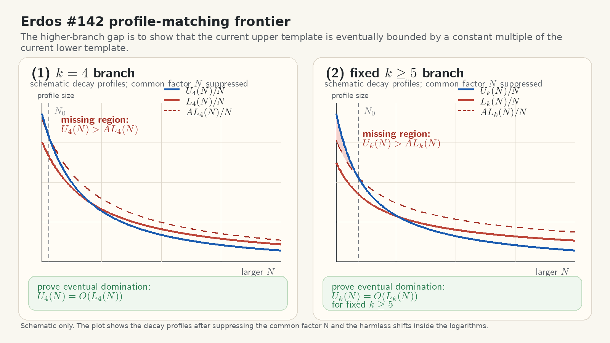

# Lean Experiments

Lean formalization experiments and problem-focused developments, using a project structure modeled after:
<https://github.com/kirill-kondrashov/yoccos-theorem>.

## Current contents

- `TaoExercises.TaoBook.Chapter2.exercise_2_3`:
  Terence Tao, *Solving mathematical problems: a personal perspective*, Exercise 2.3
  (`x^4 + 131 = 3y^4` has no integer solutions in integers).

- `TaoExercises.TaoBook.Chapter2.exercise_2_6`:
  Problem 2.6 (Shklarsky et al. 1962, p. 14):
  if `k` is odd, then `1^k + 2^k + · · · + n^k` is divisible by `1 + 2 + · · · + n`.

- `ErdosProblems` (Erdős #142 family):
  statement, explicit-profile strengthening, and gap decomposition are present under
  `Erdos142` (`erdos_problem_142`, `erdos_problem_142_explicit`, `Problem142Gap`)
  with `erdos_problem_142_iff_deepmind`, `erdos_problem_142_explicit_iff_deepmind`,
  and the current plan series in `plan/` (`PLAN_erdos_problem_142.md` and follow-on files).

## Toolchain and dependencies

- Lean: `leanprover/lean4:v4.27.0`
- mathlib: `v4.27.0`
- doc-gen4: `v4.27.0`

## Build

```bash
lake build
lake exe check_axioms
```

## Verification

All solved exercises are checked to ensure they:

- do not use `sorry`
- depend only on the base axioms `propext`, `Quot.sound`, and `Classical.choice`
- include the Problem #142 DeepMind-equivalence theorem
  (`Erdos142.erdos_problem_142_iff_deepmind`)
- include the strengthened explicit-profile DeepMind-equivalence theorem
  (`Erdos142.erdos_problem_142_explicit_iff_deepmind`)
- keep checker output explicit about temporary axiom frontier debt where present

Run:

```bash
make check
make verify
```

Expected Output:

```text
✅ The proof of 'TaoExercises.TaoBook.Chapter2.exercise_2_3' is free of 'sorry' and uses only base axioms.
Axioms used:
- propext
- Quot.sound
- Classical.choice
✅ The proof of 'TaoExercises.TaoBook.Chapter2.exercise_2_6' is free of 'sorry' and uses only base axioms.
Axioms used:
- propext
- Quot.sound
- Classical.choice
✅ The proof of 'Erdos142.erdos_problem_142_iff_deepmind' is free of 'sorry' and uses only base axioms.
Axioms used:
- propext
- Quot.sound
- Classical.choice
✅ The proof of 'Erdos142.erdos_problem_142_explicit_iff_deepmind' is free of 'sorry' and uses only base axioms.
Axioms used:
- propext
- Quot.sound
- Classical.choice
✅ The proof of 'Erdos142.erdos_problem_142_solution_axiom' is free of 'sorry' and uses only base axioms.
Axioms used:
- propext
- Quot.sound
- Classical.choice
🟡 The proof of 'Erdos142.erdos_problem_142_of_mainSplitGap_and_frontier' is free of 'sorry' but relies on temporary allowed axiom debt.
Axioms used:
- propext
- Quot.sound
- Classical.choice
- Erdos142.splitGap_k3_upper_exponent_gt_half_frontier
- Erdos142.splitGap_k4_profile_dominance_frontier
- Erdos142.splitGap_kge5_profile_dominance_frontier
Temporarily allowed non-base axioms (must be proved later):
- Erdos142.splitGap_k3_upper_exponent_gt_half_frontier
- Erdos142.splitGap_k4_profile_dominance_frontier
- Erdos142.splitGap_kge5_profile_dominance_frontier
✅ All checked items are free of 'sorry'. Temporary Erdős #142 axiom debt is explicitly allowed.
```

## Useful Make targets

```bash
make cache      # fetch Mathlib cache
make build      # lake build
make check      # lake exe check_axioms
make verify     # compare make check output with README expected output
make auto-build # cache refresh + build + check
make docs       # build API docs
```

## CI workflow (GitHub Actions)

- `.github/workflows/lean_action_ci.yml`
- Pull requests, pushes, and manual runs all execute a single `leanprover/lean-action` build job.
- Docs are not generated/deployed in CI.
- Workflow concurrency is enabled with `cancel-in-progress: true`.

## Erdős #142: current status and references

- As of March 7, 2026, Problem #142 remains open; this repository keeps the full matched-profile route behind the temporary frontier axioms `Erdos142.splitGap_k3_upper_exponent_gt_half_frontier`, `Erdos142.splitGap_k4_profile_dominance_frontier`, and `Erdos142.splitGap_kge5_profile_dominance_frontier`, while the strongest honest local $k=3$ endpoint is now the source-backed split package `Erdos142.K3SourceBackedSplitGap`, built from Kelley-Meka's explicit $\beta = 1 / 12$ upper witness together with Behrend lower data and the true compatibility direction `k3_behrend_lower_template =O k3_upper_profile`.

Exact formulation of Erdős Problem #142 in this repository:

- First define the extremal function
  $$
  r_k(N)=\max\bigl\{|A| : A \subseteq \{1,\dots,N\},\ A \text{ contains no non-trivial } k\text{-term arithmetic progression}\bigr\}.
  $$
- Then the problem asks:
  $$
  \forall k \ge 3,\ \exists f_k : \mathbb{N} \to \mathbb{R}
  \text{ such that }
  r_k(N)=\Theta(f_k(N)) \qquad (N \to \infty).
  $$
- Equivalently: for each fixed $k \ge 3$, the function $r_k(N)$ has an asymptotic formula up to multiplicative constants.
- In the local Lean formalization, this is exactly the statement
  `ErdosProblems.erdos_problem_142`; see [Problem142.lean:267](/home/kir/pers/lean-misc/ErdosProblems/Problem142.lean:267)
  and [Problem142.lean:283](/home/kir/pers/lean-misc/ErdosProblems/Problem142.lean:283).

The active missing mathematical theorems are now the higher-branch profile-matching statements.

Definition of Landau asymptotic domination:

- For real-valued functions $f(N)$ and $g(N)$, the statement
  $$
  f(N)=O(g(N)) \qquad (N \to \infty)
  $$
  means that there exist constants $A > 0$ and $N_0$ such that
  $$
  |f(N)| \le A\,|g(N)| \qquad \text{for all } N \ge N_0.
  $$
- In this section, every occurrence of $=O$ is used in exactly this sense.
- Likewise,
  $$
  f(N)=\Theta(g(N))
  $$
  means both
  $$
  f(N)=O(g(N))
  \qquad \text{and} \qquad
  g(N)=O(f(N)).
  $$

1. Theorem target for $k = 4$.

   **Given**

   Assume the following two hypotheses:

   1. Upper-side input:

      $$
      r_4(N)=O\!\left(\frac{C_u N}{(\log(N+2))^{c_u}}\right).
      $$

   2. Lower-side input:

      $$
      \frac{C_\ell N}{(\log(N+2))^{c_\ell}}=O(r_4(N)).
      $$

   **Where**
   - $r_4(N)$ is the maximal size of a $4$-term arithmetic-progression-free subset of $\{1,\dots,N\}$.
   - $N$ is the ambient interval size.
   - $C_u, C_\ell$ are positive constants independent of $N$.
   - $c_u, c_\ell$ are positive polylogarithmic decay exponents.
   - $\log$ is the natural logarithm.
   - $=O$ is Landau asymptotic domination as $N \to \infty$.
   - $N+2$ is a harmless positive shift used so the logarithm is always defined in the formal model.

   **What to prove**

   Prove the comparison theorem:

   $$
   \frac{C_u N}{(\log(N+2))^{c_u}}
   =
   O\!\left(\frac{C_\ell N}{(\log(N+2))^{c_\ell}}\right).
   $$

   **Where**
   - $C_u N / (\log(N+2))^{c_u}$ is the current split upper-profile template.
   - $C_\ell N / (\log(N+2))^{c_\ell}$ is the current split lower-profile template.
   - $=O$ is the desired eventual dominance needed to turn the split $k = 4$ data into one matched `K4ProfileWitness`.

2. Theorem target for each fixed $k \ge 5$.

   **Given**

   For each fixed $k \ge 5$, assume the following two hypotheses:

   1. Upper-side input:

      $$
      r_k(N)=O\!\left(\frac{C_u(k)\,N}{(\log\log(N+3))^{c_u(k)}}\right).
      $$

   2. Lower-side input:

      $$
      \frac{C_\ell(k)\,N}{(\log\log(N+3))^{c_\ell(k)}}=O(r_k(N)).
      $$

   **Where**
   - $r_k(N)$ is the maximal size of a $k$-term arithmetic-progression-free subset of $\{1,\dots,N\}$.
   - $k$ is a fixed integer with $k \ge 5$.
   - $N$ is the ambient interval size.
   - $C_u(k), C_\ell(k)$ are positive constants that may depend on $k$ but not on $N$.
   - $c_u(k), c_\ell(k)$ are positive iterated-log decay exponents that may depend on $k$.
   - $\log\log$ is the iterated natural logarithm.
   - $=O$ is Landau asymptotic domination as $N \to \infty$ for each fixed $k$.
   - $N+3$ is a harmless positive shift used so both logarithms are defined in the formal model.

   **What to prove**

   Prove the comparison theorem for each fixed $k \ge 5$:

   $$
   \frac{C_u(k)\,N}{(\log\log(N+3))^{c_u(k)}}
   =
   O\!\left(\frac{C_\ell(k)\,N}{(\log\log(N+3))^{c_\ell(k)}}\right)
   \qquad (k \ge 5).
   $$

   **Where**
   - $C_u(k)\,N / (\log\log(N+3))^{c_u(k)}$ is the current split upper-profile template in the $k \ge 5$ branch.
   - $C_\ell(k)\,N / (\log\log(N+3))^{c_\ell(k)}$ is the current split lower-profile template in the $k \ge 5$ branch.
   - $k \ge 5$ means the theorem is needed uniformly as a family over all higher branches.
   - $=O$ is the desired eventual dominance needed to turn the split $k \ge 5$ data into matched `Kge5ProfileWitness` packages.

Geometric illustration (schematic; common factor $N$ suppressed):



The figure is schematic only. It is not plotting computed data for $r_k(N)$; it is drawing the profile templates from Theorem `1` and Theorem `2` after suppressing the common factor $N$.

- Left panel: the $k = 4$ branch.
  - blue curve: the upper template from Theorem `1`,
    $$
    U_4(N)=\frac{C_u N}{(\log(N+2))^{c_u}}
    $$
  - red curve: the lower template from Theorem `1`,
    $$
    L_4(N)=\frac{C_\ell N}{(\log(N+2))^{c_\ell}}
    $$
  - dashed dark-red curve: a comparison envelope
    $$
    A\,L_4(N)
    $$
    for a schematic constant $A > 0$.
  - shaded red region: the part where
    $$
    U_4(N)>A\,L_4(N),
    $$
    so the desired domination has not yet been achieved.
  - dashed vertical line labeled $N_0$: a schematic threshold after which the picture shows
    $$
    U_4(N)\le A\,L_4(N) \qquad (N \ge N_0).
    $$
  - what is actually drawn is $U_4(N)/N$, $L_4(N)/N$, and $A\,L_4(N)/N$, so only the decay part in $\log(N)$ is visible.

- Right panel: the $k \ge 5$ branch.
  - blue curve: the upper template from Theorem `2`,
    $$
    U_k(N)=\frac{C_u(k)\,N}{(\log\log(N+3))^{c_u(k)}}
    $$
  - red curve: the lower template from Theorem `2`,
    $$
    L_k(N)=\frac{C_\ell(k)\,N}{(\log\log(N+3))^{c_\ell(k)}}
    $$
  - dashed dark-red curve: a comparison envelope
    $$
    A\,L_k(N)
    $$
    for a schematic constant $A > 0$.
  - shaded red region: the part where
    $$
    U_k(N)>A\,L_k(N),
    $$
    so the desired domination has not yet been achieved.
  - dashed vertical line labeled $N_0$: a schematic threshold after which the picture shows
    $$
    U_k(N)\le A\,L_k(N) \qquad (N \ge N_0).
    $$
  - what is actually drawn is $U_k(N)/N$, $L_k(N)/N$, and $A\,L_k(N)/N$, so only the decay part in $\log\log(N)$ is visible.

- In both panels, the point of the picture is to visualize the missing theorem: eventually, the blue curve should lie below the dashed comparison envelope, which is itself a constant multiple of the red curve. That is exactly the dominance statement

$$
\text{upper profile} = O(\text{lower profile})
$$

up to a multiplicative constant.

References:

- Erdős Problems #142 (status/discussion): <https://www.erdosproblems.com/142>
- Kelley, Z.; Meka, R. (2023), *Strong Bounds for 3-Progressions*:
  <https://arxiv.org/abs/2302.05537>
- Green, B.; Tao, T. (2017), *New bounds for Szemerédi's theorem, III: a polylogarithmic bound
  for r_4(N)* (Mathematika): <https://ora.ox.ac.uk/objects/uuid:1d09eef3-01e2-4ce0-ab9d-2892019812c8>
- Leng, J.; Sah, A.; Sawhney, M. (2024), *Improved bounds for Szemerédi's theorem*:
  <https://arxiv.org/abs/2402.17995>
